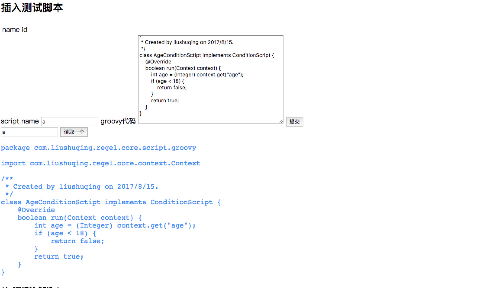
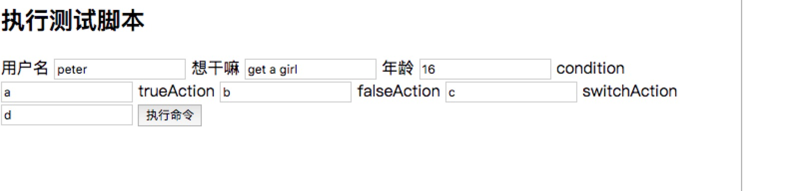

# regel

轻量级规则引擎，参考了：https://github.com/dyingbleed/g-rule
做了部分优化和代码重构&接入Spring boot，方便改造直接接入生产环境

## 使用方式

运行App.java,启动一个服务，访问localhost:8080

### 1.插入测试脚本

测试脚本就是一个groovy代码块，继承自ActionScript或者ConditionScript,左边输入脚本名字，比如a，右边提入代码块，点击提交，然后在下面输入框输入刚才的name，验证是否提交成功

### 2.执行测试用例

在这个case里面，我们的输入就三个变量，用户名（username），想干嘛（will），年龄（age），然后紧接着是响应的动作和条件脚本，点击执行，就能看到结果

### 如何在自己项目中使用

代码开源，copy本项目的core模块放在自己项目里面，或者单独拉一个轻量级服务，提供restful接口，无论如何，都是要自己实现Scriptloader这个service的～

### 为啥用groovy

groovy的同一个classLoader，在加载同一个类名时，每次加载，都会生产一个class实例，进而实现热部署。虽然有点反模式的意思，不过这不正是我们要的么，详情自己看源码